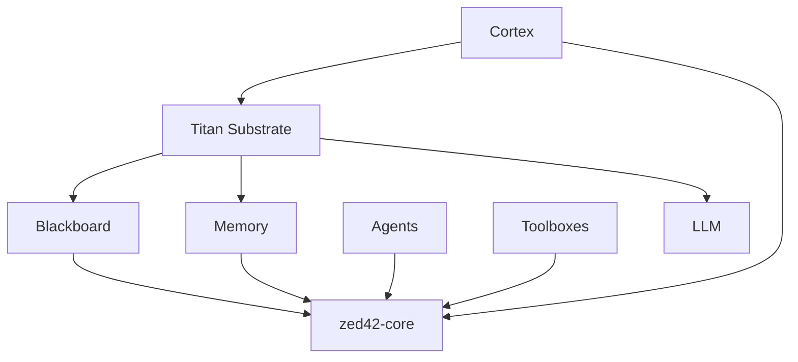

# ZED42 Project Status

**Date**: 2026-01-29
**Status**: Phase 3 Complete - Titan Substrate Hardened & Unified

## ✅ Completed Tasks

### Infrastructure

- [x] **Multi-crate Cargo Workspace** (Wide & Flat Architecture)
  - `zed42-core` (Foundational types & traits)
  - `zed42-cortex`, `zed42-blackboard`, `zed42-agents`, `zed42-toolboxes`, `zed42-memory`, `zed42-mcp`, `zed42-llm`, `zed42-ui`
- [x] **PNPM Global Store** for frontend dependencies (ADR 0001)
- [x] **Sccache Global Cache** for Rust compilation artifacts (ADR 0001)
- [x] **SurrealDB 2.x Migration** with MOM Reactive Substrate (ADR 0004)
- [x] **Titan Substrate Hardening**: Unified registry, WAL mode, and Atomic writes.
- [x] **SpaceSentry Hardware Monitoring**: Disk-lock resiliency active.
- [x] **Architectural Decision Records** re-aligned for IL, MOM, and AURA.

### Crates

| Crate | Status | Notes |
|-------|--------|-------|
| `zed42-core` | ✅ COMPLETE | Types, Traits, Result types |
| `zed42-memory` | ✅ COMPLETE | 4-tier hierarchy implemented |
| `zed42-blackboard` | ✅ COMPLETE | SurrealDB message bus |
| `zed42-agents` | ✅ COMPLETE | Agent types & lifecycle |
| `zed42-toolboxes` | ✅ COMPLETE | 17 standard toolboxes |
| `zed42-cortex` | ✅ COMPLETE | Orchestrator shell |
| `zed42-llm` | ✅ COMPLETE | Titan-injected OpenRouter wrapper |
| `zed42-mcp` | ⏳ TODO | MCP Bridge |
| `zed42-ui` | ✅ SCAFFOLDED | SolidJS + Vite (managed via pnpm) |

## 📊 Current Architecture

### Workspace Dependency Graph


### Memory Tiers (ADR 0007)
1. **Working**: DashMap (In-memory)
2. **Session**: SQLite with FTS5
3. **Knowledge Graph**: SurrealDB 2.x (MTREE Search)
4. **Archive**: DuckDB + Parquet

### Core Substrates
- **VOX**: Versatile Orchestration eXchange (ADR 0003)
- **MOM**: Message-Oriented Middleware (ADR 0004)
- **AURA**: Aura Vitality Substrate (ADR 0005)
- **TEAMS**: Adversarial Multi-Agent Teams (ADR 0006)

## 🚀 Next Steps (Phase 2: Agent Lifecycle)

1. Implement Reflexion self-critique loop in agents.
2. Connect Cortex to live blackboard subscriptions.
3. Build first end-to-end agent execution flow.

## 📝 Development Guidelines

### Building
```bash
$env:RUSTFLAGS='--cfg surrealdb_unstable'; cargo check --workspace -j 1
```

### Frontend
```bash
cd crates/ui && pnpm install && pnpm run dev
```

## 📚 Key Documents

- [README.md](README.md) - Project overview
- [ARCHITECTURE.txt](ARCHITECTURE.txt) - Detailed system design
- [docs/ADR/](docs/ADR/) - All Architectural Decision Records
- [SETUP.md](SETUP.md) - Setup instructions

---
**Last Updated**: 2026-01-20
**Version**: 0.1.0-alpha
