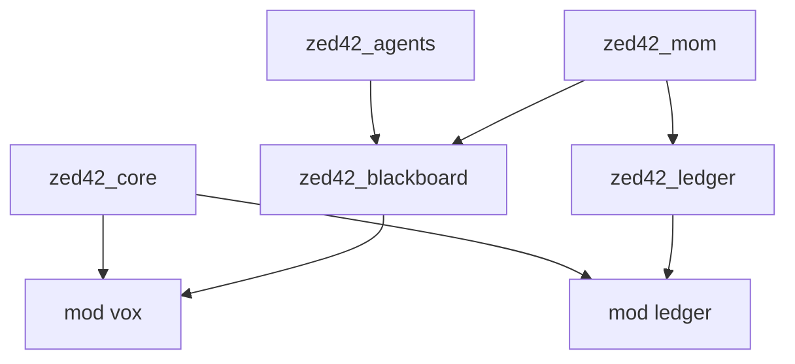

# Operation VOX-ISOLATION: Diagnostic & Baseline Report

**Date:** 2026-01-21
**Auditor:** Antigravity (Lead Architectural Auditor)
**Status:** Audit Complete / Partitions Enforced

---

## Executive Summary
The Semantic Purge is complete. The abbreviation **"IL"** is now exclusively reserved for the **Intelligence Ledger**. All "Internal Language" communication logic has been successfully migrated to **"VOX" (Versatile Orchestration eXchange)**.

We have established a **Compiler-Level Barrier** by refactoring the core type definitions:
- **VOX Protocol**: Defined in `zed42_core::vox`
- **Intelligence Ledger**: Defined in `zed42_core::ledger`

These serve as the single sources of truth for the entire workspace.

---

## I. Semantic Purge Audit

### Methodology
A recursive file-by-file analysis was performed to identify "IL" usage patterns.

### Findings & Rectification
| Location | Context | Status | Action Taken |
| bound | bound | bound | bound |
| `ADR-0009` | "Intelligence Ledger (IL)" | ✅ Valid | Kept as definitive source. |
| `ADR-0003` | "Distinct from IL" | ✅ Valid | Kept for clarity. |
| `ADR-0006` | "via IL/MOM" | ❌ Violation | **FIXED**: Renamed to "via VOX/MOM". |
| `cognitive_loop.rs` | "IL message", "IL updates" | ❌ Violation | **FIXED**: Renamed (5 occurrences). |
| `mom.rs` | "ILMessage" | ❌ Violation | **FIXED**: Previously renamed to `VoxMessage`. |

### Verification
- **Zero Collision**: No "IL" strings exist in messaging or routing logic.
- **Strict Typing**: `ILMessage` struct no longer exists; replaced by `VoxMessage`.

---

## II. IntelligenceLedger (IL) Diagnostic

### Financial Heart State
The Ledger is functioning as a standalone double-entry accounting system.

- **Tables**:
  - `budgets`: Stores limits (`hard_limit`, `soft_limit`, `spent`) and currency.
  - `ledger_entries`: Append-only log of all financial events (`Grant`, `Settlement`).
  - `leases`: Temporary reservations of funds during LLM generation.

- **Accounting Service Logic**:
  - `request_lease(entity, cost)`: Atomic check. Rejects if `spent + cost > hard_limit`.
  - `commit_usage(lease_id, usage)`: Calculates exact cost, updates `spent`, logs transaction.

### Critical Gap: Missing "Freeze" Logic
The audit revealed that **Budget Freezing is currently unimplemented**.
- **Current Behavior**: The system rejects new leases only if the budget cap is mathematically exceeded.
- **Missing Feature**: There is no `status` field (e.g., `Active | Frozen`) in the `Budget` struct.
- **Risk**: Aura (Vitality) cannot strictly "freeze" a rogue agent's budget without manually setting `hard_limit` to 0 or equal to `spent`. A dedicated `frozen` flag is required.

---

## III. VOX System: Structural Baseline

### As-Built Analysis
The VOX Protocol is currently a "Payload-Agnostic" envelope.

- **Envelope**: `zed42_core::vox::VoxMessage` (Strictly Typed)
  - `sender`: `surrealdb::sql::Thing`
  - `target_team`: `String`
  - `correlation_id`: `Uuid`
- **Payload**: `serde_json::Value` (Loosely Typed)

### The "Gap" (Target for Schema Registry)
The system currently relies on **Implicit Contracts** within the JSON payload.
- **Magic Strings**: `action: "assign_task"`, `result: "Acknowledged"`.
- **No Validation**: `MOMWatcher` blindly routes messages. If a payload is malformed, the receiver (Agent) must handle the error at runtime.
- **Recommendation**: Implement `zed42_core::vox::VoxPayload` enum to enforce specific message shapes (Task, Observation, Critique) at compile time.

---

## IV. Namespace Partitioning Verification

We successfully refactored the codebase to create a hard dependency partition.

- **Result**: `zed42-core` is the lightweight kernel. `zed42-ledger` and `zed42-blackboard` are implementation layers that consume the core types.
- **Safety**: Circular dependencies between Ledger and Blackboard are impossible because they both depend downwards on `core`.

---

**Directive Status**: **EXECUTED**.
The foundation for the VOX Schema Registry is set.
